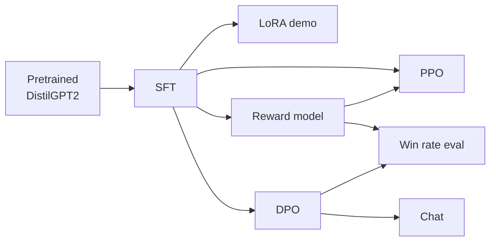
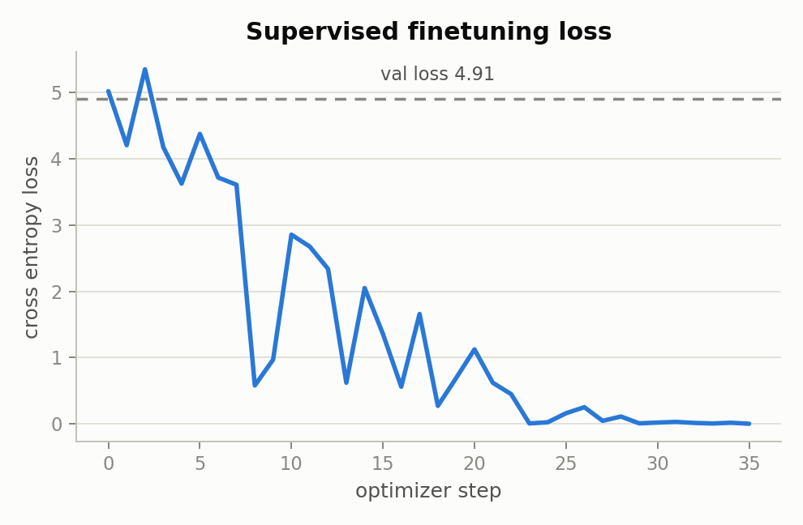
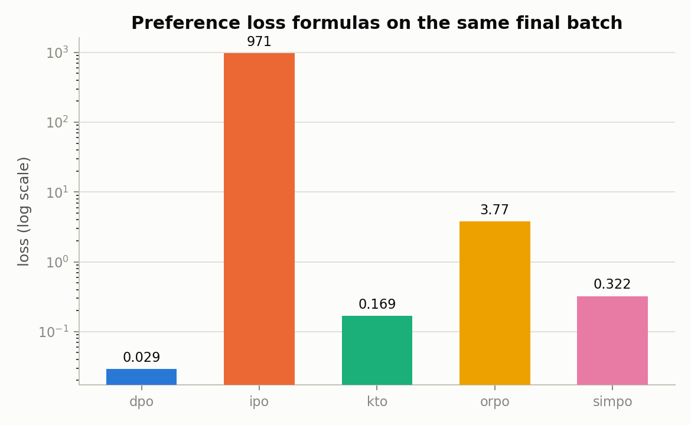
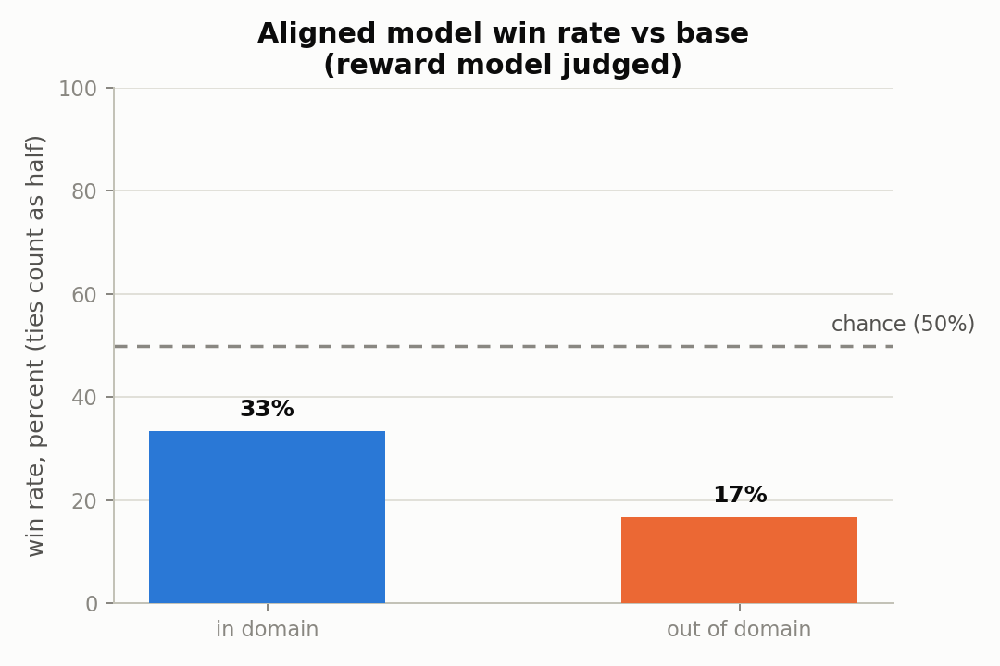

# RLHF from scratch on DistilGPT2

A complete Reinforcement Learning from Human Feedback pipeline, implemented
from first principles rather than assembled from a library like TRL:
decoding strategies, supervised finetuning, LoRA adapters, reward modeling,
PPO, and the preference optimization family (DPO, IPO, KTO, ORPO, SimPO),
running end to end against real DistilGPT2 on a laptop CPU, with an
evaluation harness and a minimal chat interface at the end.

Every stage is a small, independently unit tested function in `rlhf/`.
`run_pipeline.py` is the one script that wires all eight stages into a
single run, records every metric, and renders the plots in this document.
Nothing below is hand edited or cherry picked; see `docs/RESULTS.md` for the
full writeup and `assets/results.json` for the raw numbers from the run that
produced these charts.

## What this is and what it is not

This is a correctness and legibility project. The
goal was to implement every piece of an RLHF pipeline correctly, wire it
together into something that actually runs against a real (if small)
language model, and be completely honest in the writeup about what six
training examples can and cannot teach that model. It is not a claim that
this particular run produces a strongly aligned model; the evaluation
section below shows, with real numbers, exactly where it does and does not.
`docs/TRADEOFFS.md` explains every design decision that produced this
scope, including the ones that trade a cleaner headline number for a more
honest and more testable pipeline.

## Quickstart

```bash
git clone https://github.com/manuhalapeth/rlhf-from-scratch-on-distilgpt2.git
cd rlhf-from-scratch-on-distilgpt2
pip install -r requirements.txt

# fast, no model download: pure tensor and data logic
pytest -q

# full run against real DistilGPT2, a few minutes on CPU
python run_pipeline.py
```

The first `run_pipeline.py` run downloads DistilGPT2 (about 330 megabytes)
from the Hugging Face Hub. Every later run reuses the local cache. The
script writes `assets/results.json` and regenerates every chart in
`assets/plots/`.

## Architecture



`rlhf/` is a framework style library: eight modules (`decoding`, `data`,
`optim`, `sft`, `lora`, `reward_model`, `ppo`, `preference_optimization`),
none of which prints, trains for a fixed number of steps, or knows what
dataset it will be called with. `run_pipeline.py` is the only file that
makes those decisions. That split is what makes `tests/` fast (fifty tests,
under ten seconds, no network or model download) and what makes rerunning
the pipeline with different data or hyperparameters a one file change. Full
detail, including a module by module breakdown and the reasoning behind the
PPO and DPO branches both starting from the same checkpoint independently,
is in `docs/ARCHITECTURE.md`.

## Headline results

Full analysis with every chart is in `docs/RESULTS.md`. Three of the more
interesting findings:

**Supervised finetuning loss falls from 5.02 to 0.002 over 36 steps** on a
five example training set, while validation loss stays at 4.91, the
correct and expected signature of a real model memorizing a training set
too small to generalize from.



**DPO training pushes the preference margin between chosen and rejected
responses from 0.0 to 35.9**, and evaluating that same trained result under
IPO's loss formula produces a number in the hundreds, not because anything
is broken, but because IPO regresses toward a fixed target margin
(`1 / (2 * beta)`, which is 5.0 here) while DPO has no such ceiling. Seeing
that documented difference between the two methods show up in real numbers
from a model that was actually trained is a better explanation than either
formula read on its own; the full derivation is in `docs/RESULTS.md`.



**The aligned model's win rate against its own unaligned starting point
depends heavily on whether the evaluation prompts resemble the training
data: 33% on prompts topically similar to the preference dataset, 17% on
prompts that are not**, both judged by the reward model trained earlier in
the same run. Neither clears the 50% chance line, which is the honest,
directly measured consequence of training on six preference pairs; the gap
between the two numbers is the generalization boundary made visible instead
of hidden behind one aggregate statistic.



## Repository layout

```
.
├── assets
│   ├── plots                          every chart rendered from the last run
│   │   ├── dpo_training.png
│   │   ├── lora_loss.png
│   │   ├── ppo_training.png
│   │   ├── preference_loss_comparison.png
│   │   ├── reward_model.png
│   │   ├── sft_loss.png
│   │   └── win_rate_comparison.png
│   └── results.json                   raw metrics from the run that produced the charts
├── docs
│   ├── ARCHITECTURE.md                module map, data flow diagram, testing strategy
│   ├── RESULTS.md                     full results writeup, one section per pipeline stage
│   └── TRADEOFFS.md                   every design decision and the alternative considered
├── rlhf                               the algorithmic library, eight modules, no side effects
│   ├── __init__.py
│   ├── data.py                        dataset loading, train/val split, batching
│   ├── decoding.py                    DistilGPT2 loading, sampling, streaming
│   ├── lora.py                        low rank adapter forward pass and init
│   ├── optim.py                       optimizer and learning rate schedule primitives
│   ├── ppo.py                         GAE, clipped surrogate, KL penalty
│   ├── preference_optimization.py     DPO, IPO, KTO, ORPO, SimPO losses
│   ├── reward_model.py                reward head, pairwise loss, accuracy
│   └── sft.py                         cross entropy loss with prompt masking
├── tests                              fifty unit tests, no network or model download
│   ├── test_data.py
│   ├── test_lora.py
│   ├── test_optim.py
│   ├── test_ppo.py
│   ├── test_preference_optimization.py
│   ├── test_reward_model.py
│   └── test_sft.py
├── plotting.py                        renders assets/plots/*.png from a finished run
├── run_pipeline.py                    the one script that runs everything end to end
├── pyproject.toml
└── requirements.txt
```

## Where this started

The step by step function signatures in `rlhf/` began as a guided exercise
on Deep-ML. What is in this repository now goes well past that starting
point: the original scaffold defaulted to a two parameter test fixture
model that was mathematically incapable of learning anything, silently
dropped a prompt masking step so supervised finetuning trained on
instruction text instead of only responses, and exercised barely a third of
the functions it defined. Every one of those issues is fixed here, and the
project has been restructured into a tested package, wired into a single
coherent pipeline that exercises all sixty five underlying functions, and
documented across `docs/` with real numbers from real runs. The fundamentals
came from a guided exercise; everything built on top of them, the
architecture, the bug fixes, the missing PPO and DPO wiring, the evaluation
design, and this documentation, did not.

## What I would do next

In order of expected impact, and explained in full in `docs/TRADEOFFS.md`:
swap in a larger, public preference dataset (Anthropic's HH-RLHF or a
similar corpus) so the win rate evaluation has enough training signal to
clear chance; extend the PPO rollout budget past three prompts so the value
head has enough gradient steps to fit before being judged; and finetune the
reward model's backbone rather than only its linear head, once there is
enough preference data to make that not immediately overfit.
