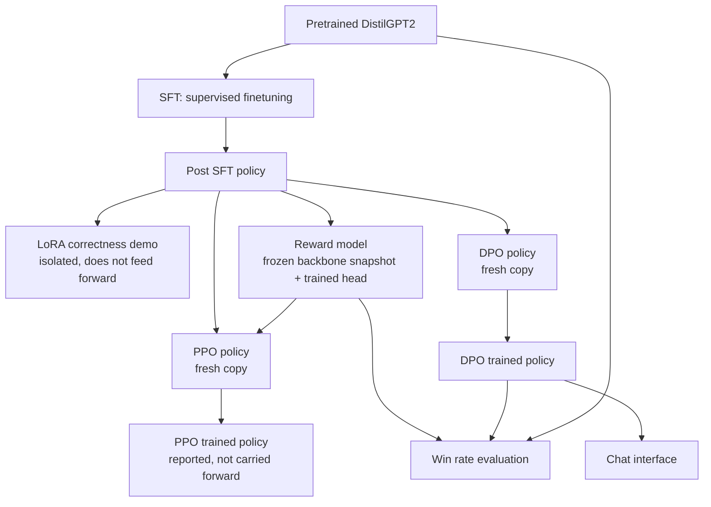

# Architecture

This document explains how the repository is organized, how data and models
flow through the pipeline, and why the code is split the way it is. If you
only read one document besides the README, read this one. It is the map for
everything else.

## Goal of the system

The system takes a pretrained causal language model (DistilGPT2) and carries it through every stage of a reinforcement learning
from human feedback pipeline, implemented from first principles rather than
imported from a library such as TRL:

1. Decode text from the raw pretrained model.
2. Supervised finetune it on instruction and response pairs.
3. Demonstrate parameter efficient adaptation with a LoRA adapter, trained by
   a hand written optimizer.
4. Train a reward model that scores completions by how much a human would
   prefer them.
5. Run Proximal Policy Optimization (PPO), the reinforcement learning
   algorithm that made ChatGPT style alignment practical, using that reward
   model as the environment's reward signal.
6. Run Direct Preference Optimization (DPO) and compare it against four
   related closed form preference losses: IPO, KTO, ORPO, and SimPO.
7. Evaluate the aligned model against the unaligned one with a reward model
   judged win rate, split into prompts that resemble the training data and
   prompts that do not.
8. Serve the aligned model through a minimal chat interface with token
   streaming.

Every one of those steps is implemented as a small, independently testable
function. `run_pipeline.py` is the only file that wires them together into a
single run and prints, plots, and records what happened.

## Repository layout

```
rlhf/                          the algorithmic library, framework agnostic
    decoding.py                 tokenizer and model loading, sampling, chat
    data.py                      synthetic datasets, prompt templates, batching
    optim.py                     hand rolled AdamW, warmup, grad clipping, grad accumulation
    sft.py                       supervised finetuning loss and training step
    lora.py                      low rank adapter math
    reward_model.py              reward head, pairwise loss, win rate scoring
    ppo.py                       PPO's building blocks: GAE, clipped surrogate, entropy
    preference_optimization.py   DPO, IPO, KTO, ORPO, SimPO
tests/                          fast, pure tensor unit tests, no network or model download
plotting.py                     turns a finished run's metrics into the plots in assets/plots
run_pipeline.py                 the orchestrator: one end to end run, real DistilGPT2
assets/
    plots/                       PNG charts generated by the last run
    results.json                 every number from the last run, machine readable
docs/
    ARCHITECTURE.md              this file
    TRADEOFFS.md                 design decisions and the alternatives considered
    RESULTS.md                   what the last run actually produced, and why
```

The split follows one rule: **`rlhf/` never imports `torch.optim`, never
prints, and never knows what dataset or how many steps it will be called
with.** Every function takes tensors or plain Python data structures in and
returns them out. That is what makes the `tests/` suite fast: most of the
math can be checked without ever loading a language model.

`run_pipeline.py` is where the opinions live: how many epochs, which
learning rate, which prompts, how the metrics get logged. Rerunning the
pipeline with different data or step counts means editing one file, not
touching the library.

## Pipeline data flow



Two things about this diagram are deliberate:

**PPO and DPO both start from the post SFT policy and not from each other's
output.** They are alternative alignment strategies for the same starting
point, and mixing their effects together would make it impossible to say
which method produced which behavior. See `docs/TRADEOFFS.md` for the full
reasoning.

**The reward model backbone is a frozen, deep copied snapshot taken right
after SFT**, not the same model object that keeps training afterward. A
reward model that silently drifts as the policy it is supposed to be
judging changes underneath it is not a fixed judge anymore. This is a detail
easy to get wrong (the original scaffold this project grew out of shared one
model instance for both roles) and worth calling out explicitly.

## Module by module

**`decoding.py`** covers everything from tokenizer loading to the final chat
wrapper: greedy decoding, temperature sampling, top k and top p filtering,
one token at a time streaming, and the `chat()` function that formats a
system and user message into the same instruction template used during SFT.

**`data.py`** has no model dependency at all. It builds the six example
synthetic instruction dataset and the six example synthetic preference
dataset used everywhere else in the pipeline, applies the instruction
template, and handles tokenization, padding, attention masks, and batching.
Because it is pure Python and tensor shape logic, it is the most heavily
unit tested module in the repository.

**`optim.py`** is a from scratch AdamW step, a linear warmup multiplier, a
global norm gradient clipper, and a micro batch gradient averager, each
implemented directly against tensors. `run_pipeline.py` uses these, not
`torch.optim`, to train the LoRA adapter, so at least one training loop in
this project does not delegate its optimizer to a library.

**`sft.py`** is the supervised finetuning loss: shifting logits and labels
by one position so token t predicts token t+1, and cross entropy that
ignores masked prompt positions.

**`lora.py`** implements a LoRA linear layer: freeze a base weight matrix,
learn a low rank update `(alpha / r) * B @ A` around it, and fold the update
back into the base weight with `merge_lora` once training is done.

**`reward_model.py`** turns a frozen backbone's last token hidden state into
a scalar score with a trained linear head, fit with a Bradley Terry pairwise
loss so that `reward(chosen) > reward(rejected)`.

**`ppo.py`** has PPO's individual pieces: per token KL against a reference
policy, discounted returns, Generalized Advantage Estimation, the
importance sampling ratio, the clipped surrogate objective, a value
function loss, an entropy bonus, and the function that combines all three
into PPO's total loss.

**`preference_optimization.py`** has DPO and the four methods usually
discussed alongside it: IPO (a squared error alternative to DPO's logistic
loss), KTO (works on unpaired desirable and undesirable examples instead of
matched pairs), ORPO (folds the preference signal directly into the
supervised finetuning loss, no reference model needed), and SimPO
(reference free, uses length normalized log probabilities as the implicit
reward).

## Why PPO and DPO are implemented so differently

PPO needs a policy that can be sampled from, a value function, and an
explicit reward signal computed at rollout time, so `run_pipeline.py`'s PPO
section is a real (if intentionally small) reinforcement learning loop:
generate a completion by sampling token by token, score it, estimate
advantages, and update. DPO, IPO, KTO, ORPO, and SimPO were all designed
specifically to avoid needing that machinery: they take a batch of already
written chosen and rejected responses and compute a closed form loss
directly from log probabilities, no sampling or reward model rollout
required (KTO, ORPO, and SimPO do not even need a reward model at all, and
ORPO and SimPO do not need a frozen reference model either). That is a real
architectural difference between the two families, not an implementation
shortcut, and it shows up directly in how much code each one takes to run.

## Testing strategy

`tests/` deliberately never downloads DistilGPT2. Every test either exercises
pure Python data wrangling (`test_data.py`) or checks a *property* of a loss
function rather than an exact numeric value, for example "the DPO loss gets
smaller as the policy separates chosen from rejected further in the
preferred direction" or "IPO's loss is minimized exactly at its target
margin, unlike DPO which keeps rewarding you for pushing past it"
(`test_preference_optimization.py`). That property based style is what
actually catches a sign error or a swapped argument order, which is the
class of bug that matters most in loss function code and the hardest to
spot by eye. The full suite runs in under ten seconds, which is what makes
it reasonable to run before every change to `run_pipeline.py`, long before
spending the several minutes a full pipeline run against real DistilGPT2
costs.

`run_pipeline.py` itself is the integration test: if the shapes, masks, and
gradient flow between all eight stages are not consistent, it throws, not
silently produces garbage.
