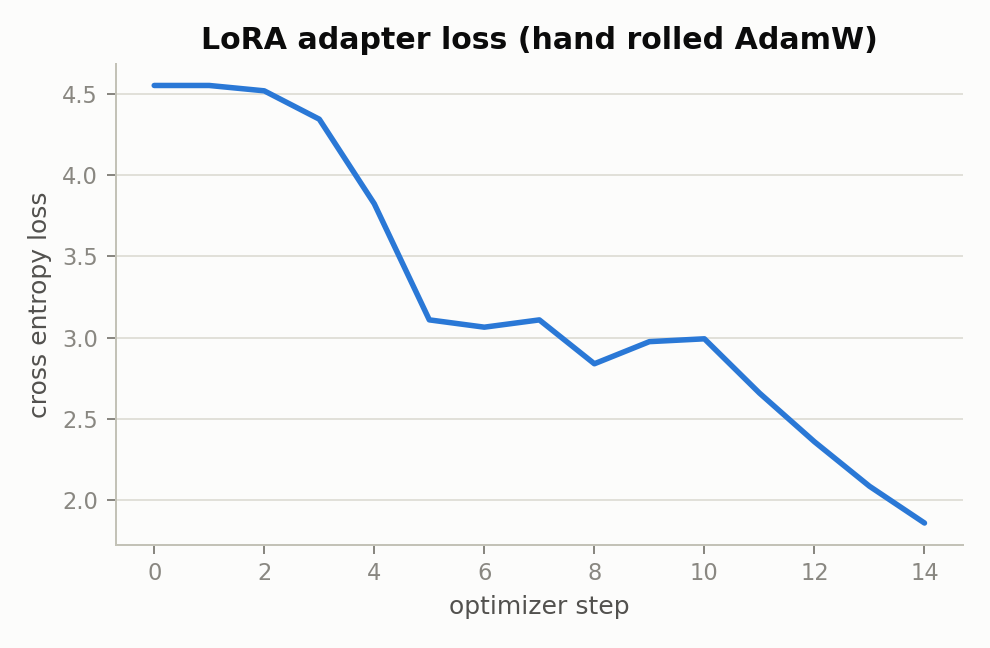
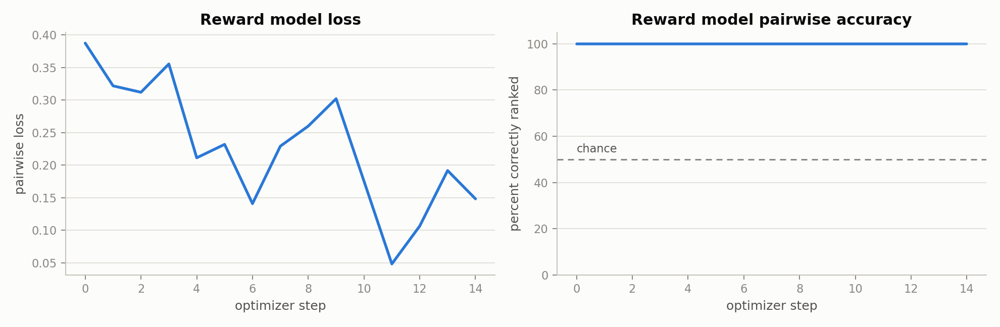
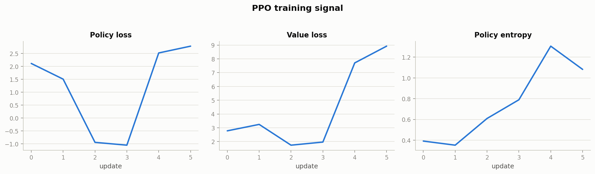
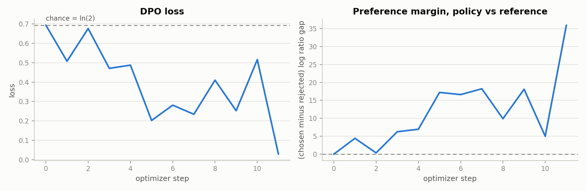

# Results

Every number and chart on this page came from one real run of
`python run_pipeline.py` against real DistilGPT2 on a laptop CPU, with fixed
random seeds (`numpy` and `torch` both seeded to zero). The complete machine
readable output of that run is committed at `assets/results.json`, and the
raw console log is reproducible by running the script yourself; nothing here
is hand edited or cherry picked from multiple runs. Rerunning the script will
land in the same neighborhood but not reproduce these exact figures, since
the small step counts leave real run to run variance even with fixed seeds
(CPU floating point reduction order is not perfectly deterministic across
runs).

Read this page alongside `docs/TRADEOFFS.md`, which explains *why* each
setup choice was made; this page is about what actually happened once those
choices were in place.

## Supervised finetuning

Training loss drops from 5.02 to 0.002 over 36 optimizer steps (12 epochs
across a five example, batch size two training set). Validation loss stays
at 4.91, far above the training loss. That gap is not a bug, it is the
correct and expected outcome of finetuning a real language model on five
training examples with no held out generalization possible: the model has
enough capacity to memorize five short instruction and response pairs
almost exactly, and there is no way for a five example training set to teach
it to generalize to a validation example about a completely different
topic. The post finetuning completion for "What is the capital of Japan?"
comes back as "Tokyo. Tokyo. Tokyo. Tokyo. Tokyo. Tokyo.", a direct, if
repetitive, echo of the training example "The capital of Japan is Tokyo."
Compare that to the base, unfinetuned model's completion for an unrelated
prompt, which trails off into newline characters, the well known degenerate
behavior of a GPT2 family model that was never instruction tuned, asked a question it
was never trained to answer directly.

The honest reading: this demonstrates that the SFT training loop, loss
masking, optimizer wiring, and learning rate schedule are all correct and
capable of driving loss to near zero on a real model, not that five examples
constitute a usable instruction tuning dataset.

## LoRA correctness demo

Before training starts, the code asserts and prints that a zero initialized
`B` matrix makes `lora_linear_forward`'s output identical to the frozen base
model's own output (`True` in `assets/results.json`), which is the property
LoRA depends on to be able to start training from the base model's exact
behavior rather than a random perturbation of it. The adapter (rank eight,
alpha sixteen, applied to the real `lm_head` projection) is then trained for
fifteen steps entirely with the hand written AdamW step, linear warmup, and
gradient clipping in `rlhf/optim.py`, no `torch.optim` involved, using
gradients averaged across two differently sized micro batches by
`accumulate_gradients`. Loss falls from 4.55 to 1.86. Trainable parameter
count comparison: the frozen base model reports zero trainable parameters
after `freeze_base_params`, while the LoRA adapter alone is 408,200
parameters, about half a percent of the combined total, which is the entire
point of LoRA as a technique. After training, `merge_lora`'s folded weight
produces output identical to the unfolded adapter's forward pass to five
decimal places (`True`), confirming the merge math is exact, not an
approximation.

An earlier version of this run used a larger learning rate (0.05) and a
shorter warmup (three steps), which caused the loss to spike from about 2.2
up past 19 before recovering by the final step, classic optimizer
instability from stepping too far in a single update on a matrix with fifty
thousand output rows. Lowering the learning rate to 0.01 and extending
warmup to five steps, both visible in `run_pipeline.py`, produced the
smooth curve shown above. That instability and its fix are left in this
document deliberately: it is a real example of the kind of tuning problem
that shows up constantly in practice, and hiding it would make this page
less useful, not more polished.

## Reward model

The reward model is a single trained linear head on top of a frozen,
independently snapshotted copy of the finetuned backbone (see
`docs/TRADEOFFS.md` for why the backbone is frozen and separate rather than
shared with the policy). Pairwise loss falls from 0.387 to 0.148 over
fifteen steps across five epochs of a twelve example preference set, and
pairwise ranking accuracy is 100% from essentially the first step onward:
the six underlying preference pairs in the synthetic dataset are
constructed with a large, easy to detect quality gap between the chosen and
rejected response (compare "The capital of France is Paris." against "I do
not know."), so a linear probe on a real language model's hidden states
finds them trivially separable. A perfect accuracy number here is a
statement about how easy this particular synthetic dataset is, not a claim
that the reward model would hold up against subtler, more realistic
preference judgments.

Raw reward scores from this model are not naturally on any particular
numeric scale (nothing in the Bradley Terry pairwise loss constrains it),
and this run's scores over the training distribution came out with mean
about negative 13.47 and standard deviation about 2.12. Every later use of
this reward model standardizes against those exact statistics before the
score is used anywhere else in the pipeline.

## PPO

Three prompts are sampled from with temperature 0.8 and top k 50 filtering
(exercising the sampling code directly, not just greedy decoding), scored by
the now standardized reward model, and used to run two inner PPO update
epochs each, six updates total. Normalized rewards for the three sampled
rollouts were 0.42, 4.39, and negative 1.99, meaning the reward model liked
the second rollout well above the training distribution's average and the
third rollout somewhat below it: real variance in completion quality across
only three samples, not a bug.

Policy loss moves from 2.11 to 2.78 and value loss from 2.78 to 8.92 across
six updates. Neither number should be read as "PPO is failing to converge"
by itself. With a value head being trained completely from scratch across
only six gradient updates, on a mix of extreme normalized reward magnitudes
(4.39 and negative 1.99 in the same tiny batch of rollouts), a rising value
loss simply means the value function has not had anywhere near enough
signal yet to fit its regression targets, which is expected at this scale
and is exactly what a value loss curve is supposed to reveal when read
correctly, rather than being disguised by only reporting a single combined
loss number. Policy entropy rises from 0.39 to 1.08 over the same steps,
meaning the policy became less peaked, more willing to spread probability
mass across multiple tokens; on this little data this is closer to noise
than a sign of deliberate, controlled exploration, but it is not a
divergence or a collapse either. This section demonstrates that every piece
of the PPO objective, per token KL, GAE, the clipped surrogate, the value
loss, and the entropy bonus, is wired correctly and produces finite, sane
gradients end to end; it does not demonstrate that six gradient updates are
enough to meaningfully train a reinforcement learning policy, because they
are not, on any implementation.

## DPO, and a comparison against IPO, KTO, ORPO, and SimPO

DPO trains a fresh copy of the finetuned model against a frozen reference
copy of that same starting point, over twelve steps (four epochs across a
twelve example preference set, batch size four). Loss starts at 0.693,
exactly `ln(2)`, the loss value at zero separation between chosen and
rejected, which is the correct starting point for an untrained policy that
has not yet diverged from its own reference. Loss ends at 0.029, and the
preference margin (how much more the policy prefers chosen over rejected,
relative to how much the frozen reference did) grows from 0.0 to 35.9. Both
curves are the textbook signature of DPO training working correctly.

DPO is the only method whose weights are actually updated in this run; IPO,
KTO, ORPO, and SimPO are all evaluated once, on the exact final batch DPO
trained against, to compare what each loss formula reports about the same
trained result (see `docs/TRADEOFFS.md` for why training all five
separately was judged not worth the added compute for this iteration of the
project). Four of the five land in an unsurprising range: KTO at 0.169,
SimPO at 0.322, ORPO at 3.77. IPO is the interesting one, at 971, plotted on
a logarithmic axis because it is roughly three orders of magnitude larger
than the others.

That large IPO number is not a bug, and understanding why is one of the
more useful things this page can show. DPO's loss keeps getting smaller the
further apart it pushes chosen and rejected, with no ceiling: `-log_sigmoid`
approaches zero asymptotically but never actually reaches it, so nothing in
DPO's objective tells the optimizer to stop once chosen is "sufficiently"
preferred over rejected. IPO was proposed specifically to fix that
unbounded behavior by regressing the preference margin toward a fixed
target, `1 / (2 * beta)`, which for the beta used elsewhere in this project
(0.1) is a target margin of 5.0. This run's DPO training pushed the
preference margin to 35.9, roughly seven times past IPO's target. Squaring
that overshoot, `(35.9 - 5.0)^2`, lands almost exactly on the observed IPO
loss of 971. In other words, this number is IPO's loss function doing
precisely what it was designed to do: penalize a policy for a preference
margin blowing well past a fixed, deliberately chosen target, and DPO's own
lack of such a target is exactly what let the margin get that large in the
first place. Seeing that relationship appear in real numbers, computed from
a model that was actually trained, is a more convincing demonstration of
the DPO versus IPO distinction than either formula read on its own.

## Evaluation: in domain versus out of domain win rate

The DPO trained model is compared against the untouched, never finetuned
base model, judged by the frozen reward model, on two separate six prompt
sets. The out of domain set (`build_eval_prompt_set` in
`rlhf/decoding.py`, unrelated topics like the water cycle and productivity
tips) produces a 17% win rate for the aligned model. The in domain set
(`build_in_domain_eval_prompt_set` in `run_pipeline.py`, topically similar
to the preference training data, capital cities, arithmetic, a science
explanation, without repeating the literal training prompts) produces a 33%
win rate. Both numbers sit below the 50% chance line.

Two honest conclusions follow from that pair of numbers, and it matters
that they are read together rather than separately. First, alignment
transfer is directional: the aligned model does relatively better on
prompts that resemble what it was trained on than on prompts that do not (33%
against 17%), which is exactly the generalization gap you would expect from
training on six preference pairs covering six narrow topics. Second, neither
number clears chance, meaning six preference pairs are not enough data for
this reward model and this small a policy to produce a model that reliably
beats its own unaligned starting point even on favorable, topically similar
prompts, let alone unrelated ones. A repository that only reported a single
win rate number could not distinguish between "alignment does not work
here" and "alignment works somewhat, but only within the narrow slice of
behavior it was actually trained on;" splitting the evaluation is what
makes that distinction visible, and the honest answer this run supports is
the second one, weakly.

The qualitative completions in `assets/results.json` tell the same story
more plainly than the win rate number does: several out of domain prompts
produce nothing but repeated newline characters from both models, the well
known degenerate output of a GPT2 family model given a prompt style it was
never trained to continue, while several in domain prompts produce short,
topically appropriate, if repetitive, sentences from the aligned model (for
example "Gravity is a force in a vacuum. Gravity is a force in a vacuum.").

## Chat interface

Asking the aligned model to "Say hi." under a "You are helpful." system
prompt returns "Bonjour.", repeated four times, a direct echo of the single
French translation example in the five example supervised finetuning set,
generalized (incorrectly, but explainably) to an unrelated greeting prompt.
Streaming a completion for "The capital of France is" token by token
returns " Paris. The capital of France is Paris. The capital of", which is
both grammatically coherent and factually correct, and directly traceable
to the "What is the capital of France? The capital of France is Paris."
pair in the synthetic preference dataset. Both outputs are small, honest,
traceable windows into exactly what this model did and did not learn from
six total training examples across SFT and preference data combined.

## What would change these numbers most

In order of expected impact, based on the reasoning in `docs/TRADEOFFS.md`:
a larger and more diverse preference dataset (the current six pairs are
each memorized almost immediately, which is why the win rate does not clear
chance even in domain); more PPO rollouts and update steps, so the value
head has enough signal to fit before being judged; and finetuning the
reward model's backbone rather than only its head, at the cost of needing
enough preference data to make that not immediately overfit. None of these
require an architectural change, only more data and more compute, which is
exactly the tradeoff `docs/TRADEOFFS.md` describes as deliberately not
taken in this iteration of the project.
